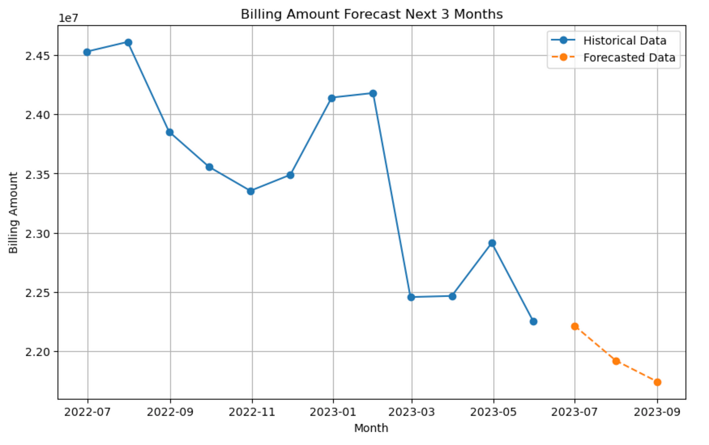
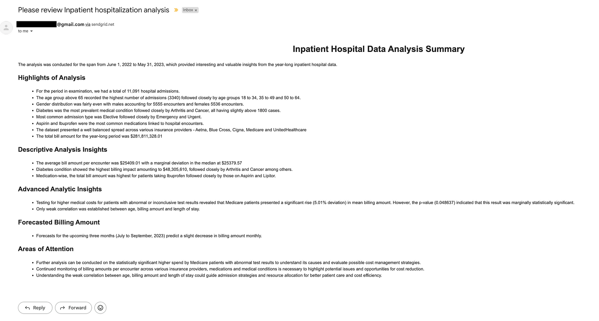

# Building and Delivery a Standardized Reporting Framework with Python and LLMs: Strategy I
## Introduction
In the age of data-driven decision-making, analysts often face the challenge of creating repeatable, accurate, up-to-date, and insightful reports in a timely manner for various areas of focus, while customizing outputs for different decision-makers in their organizations. These decision-makers, such as administrators and executives, rely on these reports to track key developments - whether monitoring KPIs and trends, understanding financial performance, controlling organizational spending, or uncovering other critical business insights. Beyond descriptive analysis, reports need to cut through the noise that masks true insights, where a blend of statistical and predictive analytics can be particularly helpful. This kind of reporting is crucial but often time-consuming, given the complexity of tasks involved.
With this scenario in mind, I wanted to explore two key questions:
1. Can we create a standardized reporting framework that combines analytics methodologies (applied via code) with LLM models to generate narratives and identify actionable insights based on the analysis?
2. Can we take it a step further and enable LLM models to directly execute specified analytics methodologies, without writing code, and still generate narratives and highlight useful findings?

The motivation for this experiment is not to prove that analysts' tasks can be replaced. Rather, I firmly believe that the true value of data analysts lies in their rich domain knowledge, their ability to ask the right questions, apply appropriate methodologies, and eliminate noise to uncover genuinely insightful findings. This experiment is about enhancing the reporting process to improve efficiency - not replacing the human expertise behind it.

To approach these questions, I divided the experiment into two strategies:\
**Strategy I (S1)**: Focuses on the first question, exploring how Python-based analytics can complement LLMs for generating insightful narratives.\
**Strategy II (S2)**: Focuses on the second question, investigating whether LLMs can handle analytics tasks directly via prompt engineering.

## Framework
Regardless of the approach (**S1** or **S2**), the core tasks in generating analytics reports typically include:\
1. Preprocessing data: Cleaning, organizing, and preparing the data for analysis.
2. Computing descriptive metrics: Summarizing key characteristics of the data.
3. Applying advanced analytics: Employing statistical or predictive models to test hypotheses.
4. Identifying insights and validating results: Highlighting significant findings for review.
5. Generating artifacts: Creating outputs tailored to the needs of various stakeholders.

### Focus of **Strategy I**
In **S1**, Steps 1 to 3 are accomplished through traditional methods where analysts write code for computation and hypothesis testing. The goal is to use LLMs to:
Highlight important insights: Allowing human experts to focus on validation and interpretation.
Generate customized reports: Tailored for different stakeholders (e.g., CFOs may require more granular financial insights, whereas managers may need broader operational overviews).

This article demonstrates how these objectives are achieved in **S1**.

### Preview of Strategy II
In **S2**, the focus shifts to leveraging LLMs for Steps 2 and 3 - computing metrics and performing advanced analytics directly via prompt engineering. The outputs from S1 serve as a baseline, as they are deterministic, for evaluating the results of **S2**. Specifically, **S2** will address:
1. **The extent of prompt engineering required:** To replicate the outcomes from S1.
2. **Consistency in generating expected results:** Over multiple runs.
3. **Alignment of insights:** Comparing the insights generated in S1 and S2, assuming metrics are similar.

### Advantages of the Framework
Deploying both strategies could offer significant advantages if proven reliable:
1. **Standardization and Repeatability:** S1 ensures deterministic results through code, which can be validated and reused.
2. **Flexibility with LLMs:** S2 allows non-coders to interact with data and perform complex analytics tasks via natural language queries.

While many practitioners have demonstrated that LLMs excel at tasks like summarization (provided the content is accurate and with proper guardrails), my experience has shown that LLMs perform well for basic computations (e.g., sum, average, min, max), but relying on LLMs for more complex models has proven inconsistent, which required further exploration in **S2**.

If the use of LLMs for advanced analytics can be optimized and made reliable, we could envision a future where analysts and non-coders alike can request complex computations and receive accurate results without writing a single line of code. This would significantly boost productivity, enabling personnel at all levels to engage with their data in a meaningful way, regardless of technical expertise.
In this article, I demonstrate S1 and set the foundation for S2. Let's dive in!
## Setup
The Jupyter notebook for this framework is available on [GitHub]([https://website-name.com](https://github.com/jasminewilkerson/LLM_reporting/tree/main)).
### Dataset
Given my familiarity with healthcare data, I chose a synthetic healthcare dataset available on Kaggle, curated by Prasad Pati, for demonstration purposes. The dataset can be downloaded [here]. This dataset consists of:
- 10,000 synthetic patient records, with each row representing a unique patient encounter.
- Various variables such as demographics, medical conditions, admission types, and admission/discharge dates.

Since the dataset is entirely synthetic, no real insights can be derived from the analysis. It is strictly used for demonstration purposes.
### Modifications
To better align with the experiment's goals, I made a few modifications to the dataset by adding:
- An encounter_id column to uniquely identify each patient encounter.
- An age_group column to categorize patients into predefined age brackets.
- End of month for date field - admission_EOM_date, discharge_EOM_date
- An length_of_stay column to measure days in hospital before discharged.

```import pandas as pd 
import numpy as np 

start_date = pd.to_datetime('2022-04-01')
end_date = pd.to_datetime('2023-05-31')

# import data
df = pd.read_csv('/Downloads/healthcare_dataset.csv')

# convert date in string type to datetime
date_col = ['Date of Admission', 'Discharge Date']
for col in date_col:
    df[col] = pd.to_datetime(df[col])

# add end of month columns for date field
df['admission_EOM_date'] = df['Date of Admission'].apply(lambda x: x + pd.offsets.MonthEnd(0))
df['discharge_EOM_date'] = df['Discharge Date'].apply(lambda x: x + pd.offsets.MonthEnd(0))

# add encounter_id 
df['encounter_id'] = df.index + 101

# add age_group column
def age_group_range(age):
    if age < 18:
        return 'age_group_0_to_17'
    elif age < 35:
        return 'age_group_18_to_34'
    elif age < 50:
        return 'age_group_35_to_49'
    elif age < 65:
        return 'age_group_50_to_64'
    else:
        return 'age_group_above_65'
df['age_group'] = df['Age'].apply(lambda x: age_group_range(x))

# compute LOS
df['length_of_stay'] = (df['Discharge Date'] - df['Date of Admission']).dt.days

# subset data based on date range
df = df[(df['Date of Admission']>=start_date) & (df['Date of Admission']<end_date)]
```

## Descriptive Analysis
Below are examples of descriptive metrics commonly tracked in healthcare organizations for one year of data:
### Overview Metrics
- Total number of patient encounters.
- Total number of unique patients.

### Utilization Metrics
- Distribution of encounters by:
    - Age group
    - Gender
    - Medical conditions
    - Admission types
    - Medications prescribed
    - Insurance providers
### Financial Metrics
- Total bill amount.
- Total bill amount by medical conditions
- Total bill amount by medications
- Average bill amount per encounter
- Median bill amount per encounter

```## Overview metrics

# Number of encounters
total_encounter_count = df['encounter_id'].nunique()
# Number of patients
total_patient_count = df['Name'].nunique()

## Utilization Metrics

# Distribution by Age
age_dist = df.groupby('age_group')['encounter_id'].size().reset_index().rename(columns={'encounter_id':'encounterCount'}).to_string()
# Distribution by Gender
gender_dist = df.groupby('Gender')['encounter_id'].size().reset_index().rename(columns={'encounter_id':'encounterCount'}).to_string()
# - Distribution by Medical Condition
condition_dist = df.groupby('Medical Condition')['encounter_id'].size().reset_index().rename(columns={'encounter_id':'encounterCount'}).to_string()
# - Distrituion Admission Type
admit_dist = df.groupby('Admission Type')['encounter_id'].size().reset_index().rename(columns={'encounter_id':'encounterCount'}).to_string()
# - Distribution Medication
med_dist = df.groupby('Medication')['encounter_id'].size().reset_index().rename(columns={'encounter_id':'encounterCount'}).to_string()
# - Distribution by Insurance Provider
ins_dist = df.groupby('Insurance Provider')['encounter_id'].size().reset_index().rename(columns={'encounter_id':'encounterCount'}).to_string()

## Financial Metrics

# Total Billing Amount
total_bill_amount = df['Billing Amount'].sum()
# Total Bill Amount by Condition
total_amount_by_cond = df.groupby('Medical Condition')['Billing Amount'].sum().reset_index().rename(columns={'Billing Amount':'total_bill_amount'}).to_string()
# Total Bill Amount by Medical Condition
total_amount_by_med = df.groupby('Medication')['Billing Amount'].sum().reset_index().rename(columns={'Billing Amount':'total_bill_amount'}).to_string()
# Avg Bill Amount by encounter
avg_enc_amount = df['Billing Amount'].sum()/df['encounter_id'].nunique()
# Median Bill Amount by encounter
median_enc_amount = df['Billing Amount'].median()
```

## Statistical Analysis
For statistical analysis, I selected a few fundamental and widely used models:
1. **T-Test for Hypothesis Testing**

- Purpose: Identify significant differences in billing amounts between cohorts.
- Hypotheses: Compare bill amounts for encounters with abnormal/inconclusive test results versus those with normal test results.
- Identify which insurance plans show statistically significant differences in bill amounts.

```
# Hypothesis: Encounter with abnormal or inconclusive test result has higher billing amount per encounter
# Statistically significant value: P-value < 0.05 

from scipy.stats import ttest_ind

insurance_provider_list = df['Insurance Provider'].unique()
res_df = pd.DataFrame()
for ins in insurance_provider_list:
    res = pd.DataFrame({'insurance_provider':ins}, index=[0])
    cohort_a = df[
        (df['Test Results']!='Normal') &
        (df['Insurance Provider']==ins)]
    cohort_b = df[
        (df['Test Results']=='Normal') &
        (df['Insurance Provider']==ins)]
    stat_ttest, p_ttest = ttest_ind(cohort_a['Billing Amount'], cohort_b['Billing Amount'])
    res['t_test_stat'] = stat_ttest
    res['p_value'] = p_ttest
    res['mean_bill_amount_reference'] = round(cohort_b['Billing Amount'].mean(),0)
    res['mean_bill_amount_target'] = round(cohort_a['Billing Amount'].mean(),0)
    res['percent_deviate'] = round((res['mean_bill_amount_target']-res['mean_bill_amount_reference'])/res['mean_bill_amount_reference']*100,2)
    res['change_direction'] = np.where(res['percent_deviate']<0, 'lower', 
                                       np.where(res['percent_deviate']>0, 'higher', 'no change'))

    res_df = pd.concat([res_df, res])

ttest_string_df = res_df.to_string()
```

2. **Correlation Coefficient Analysis**
Purpose: Measure the correlation between all combinations of two continuous variables to assess their linear relationships.
```
import itertools

continuous_var = ['Age', 'Billing Amount', 'length_of_stay']
pair_var_list = list(itertools.combinations(continuous_var, 2))

corr_res = pd.DataFrame()
for cols in pair_var_list:
    res = pd.DataFrame({
        'var_1':cols[0],
        'var_2':cols[1],
        'correlation_coefficient': df[cols[0]].corr(df[cols[1]])
        }, index=[0])
    corr_res = pd.concat([corr_res, res])

corr_res['direction'] = np.where(corr_res['correlation_coefficient']<0, 'negatively correlated', 'positively correlated')
corr_res_string = corr_res.to_string()
```
3. **Forecasting with ARIMA**
Purpose: Predict future metrics for total billing amounts over the next 3 months using statistical forecasting techniques.
```
import pandas as pd
import numpy as np
import matplotlib.pyplot as plt
from statsmodels.tsa.arima.model import ARIMA

arima_df = df.groupby('admission_EOM_date')['Billing Amount'].sum().reset_index().sort_values('admission_EOM_date')
arima_df['admission_EOM_date'] = pd.to_datetime(arima_df['admission_EOM_date'])
arima_df.set_index('admission_EOM_date', inplace=True)

# Build and Fit ARIMA Model
model = ARIMA(arima_df['Billing Amount'], order=(2, 1, 2))  # Order can be fine-tuned
fitted_model = model.fit()

# Forecast the next 3 months
forecast_steps = 3
forecast = fitted_model.forecast(steps=forecast_steps)

# Create forecast dates
forecast_dates = pd.date_range(arima_df.index[-1] + pd.DateOffset(months=1), periods=forecast_steps, freq='MS')

# Combine historical data and forecast
forecast_df = pd.DataFrame({
    "Month": forecast_dates,
    "forecasted_billing_amount": forecast.values
})
forecast_df.set_index("Month", inplace=True)

# Visualize forecast
plt.figure(figsize=(10, 6))
plt.plot(arima_df.index, arima_df['Billing Amount'], marker='o', label="Historical Data")
plt.plot(forecast_df.index, forecast_df['forecasted_billing_amount'], marker='o', label="Forecasted Data", linestyle='--')
plt.title("Billing Amount Forecast Next 3 Months")
plt.xlabel("Month")
plt.ylabel("Billing Amount")
plt.grid()
plt.legend()
plt.show()

# Print Forecasted Values
forecast_df = forecast_df.reset_index()
forecast_df_string = forecast_df.to_string()
```


### Disclaimer
This experiment assumes that all statistical requirements, such as independence of variables, normality, stationarity, linearity, and other relevant assumptions, are satisfied. When applying these techniques in real-world scenarios, appropriate diagnostic tests must be conducted to ensure the validity of the statistical models.
## Output as Prompt
The results from the analysis are structured along with instruction text to be input as a prompt into the LLM model (GPT-4o). General instructions on identifying insights and formatting the output are included in the system prompt. See the example prompt snapshot below:
To construct the input prompts, results from each analytics are passed in as parameters, along with metadata (data date range), description of metrics and intention of the test. 
### Descriptive analytics as prompt:
```
descriptive_summary = f"Section 1: Descriptive analytics\n\
Analysis was conduction with data between {start_date.strftime('%Y-%m-%d')} and {end_date.strftime('%Y-%m-%d')}\n\n\
Overview analysis\n\
- Number of hospital admission = {total_encounter_count}\n\
- Distribution by encounter by age groups:\n\
    {age_dist}\n\n\
- Distribution by encounter by gender:\n\
    {gender_dist}\n\n\
Utilization analysis\n\
- Distribution by encounter by medical conditions:\n\
    {condition_dist}\n\n\
- Distribution by encounter by admission types:\n\
    {admit_dist}\n\n\
- Distribution by encounter by medications:\n\
    {med_dist}\n\n\
- Distribution by encounter by insurance providers:\n\
    {ins_dist}\n\n\
Financial analysis\n\
- Total bill amount = ${total_bill_amount:.2f}\n\
- Average bill amount per encounter = ${avg_enc_amount:.2f}\n\
- Median bill amount per encounter = ${median_enc_amount:.2f}\n\
- Distribution by total bill amount by medical condition:\n\
    {total_amount_by_cond}\n\n\
- Distribution by total bill amount by medication:\n\
    {total_amount_by_med}"

print(descriptive_summary)
```
```
Section 1: Descriptive analytics
Analysis was conduction with data between 2022-06-01 and 2023-05-31

Overview analysis
- Number of hospital admission = 11091
- Distribution by encounter by age groups:
                age_group  encounterCount
0   age_group_0_to_17              32
1  age_group_18_to_34            2737
2  age_group_35_to_49            2454
3  age_group_50_to_64            2528
4  age_group_above_65            3340

- Distribution by encounter by gender:
       Gender  encounterCount
0  Female            5536
1    Male            5555

Utilization analysis
- Distribution by encounter by medical conditions:
      Medical Condition  encounterCount
0         Arthritis            1892
1            Asthma            1779
2            Cancer            1857
3          Diabetes            1907
4      Hypertension            1831
5           Obesity            1825

- Distribution by encounter by admission types:
      Admission Type  encounterCount
0       Elective            3770
1      Emergency            3667
2         Urgent            3654

- Distribution by encounter by medications:
        Medication  encounterCount
0      Aspirin            2295
1    Ibuprofen            2270
2      Lipitor            2216
3  Paracetamol            2117
4   Penicillin            2193

- Distribution by encounter by insurance providers:
      Insurance Provider  encounterCount
0              Aetna            2113
1         Blue Cross            2180
2              Cigna            2263
3           Medicare            2312
4   UnitedHealthcare            2223

Financial analysis
- Total bill amount = $281811328.01
- Average bill amount per encounter = $25409.01
- Median bill amount per encounter = $25379.57
- Distribution by total bill amount by medical condition:
      Medical Condition  total_bill_amount
0         Arthritis       4.915173e+07
1            Asthma       4.487660e+07
2            Cancer       4.558493e+07
3          Diabetes       4.830561e+07
4      Hypertension       4.700701e+07
5           Obesity       4.688545e+07

- Distribution by total bill amount by medication:
        Medication  total_bill_amount
0      Aspirin       5.742889e+07
1    Ibuprofen       5.792602e+07
2      Lipitor       5.664887e+07
3  Paracetamol       5.366291e+07
4   Penicillin       5.614465e+07
``` 

### Statistical model output as prompt:
```
advanced_analytics_summary = f"Section 2: Advanced analytics\n\
Advanced analysis was conduction with data between {start_date.strftime('%Y-%m-%d')} and {end_date.strftime('%Y-%m-%d')}\n\n\
Hypothesis: Encounter with abnormal or inconclusive test result is statistical signficantly higher in billing amount per encounter\n\
Statistically significant if P-value < 0.05 \n\
- Result table to test for billing amount being higher for patients with abnormal or inconclusive test result:\n\n\
    {ttest_string_df}\n\n\
Correlation between continuous variables\n\
- Result table to measure correlation between two continuous variables:\n\n\
    {corr_res_string}\n\n\
Forecast of billing amount for the next three months\n\
- Result table to forecast for billing amount for the next three months:\n\n\
    {forecast_df_string}"

print(advanced_analytics_summary)
```
```
Section 2: Advanced analytics
Advanced analysis was conduction with data between 2022-06-01 and 2023-05-31

Hypothesis: Encounter with abnormal or inconclusive test result is statistical signficantly higher in billing amount per encounter
Statistically significant if P-value < 0.05 
- Result table to test for billing amount being higher for patients with abnormal or inconclusive test result:

      insurance_provider  t_test_stat   p_value  mean_bill_amount_reference  mean_bill_amount_target  percent_deviate change_direction
0              Aetna     0.392390  0.694809                     25394.0                  25651.0             1.01           higher
0         Blue Cross    -0.410576  0.681424                     25532.0                  25269.0            -1.03            lower
0              Cigna     0.792691  0.428041                     25136.0                  25644.0             2.02           higher
0   UnitedHealthcare     0.373760  0.708618                     25163.0                  25404.0             0.96           higher
0           Medicare     1.972803  0.048637                     24499.0                  25726.0             5.01           higher

Correlation between continuous variables
- Result table to measure correlation between two continuous variables:

                var_1           var_2  correlation_coefficient              direction
0             Age  Billing Amount                 0.003915  positively correlated
0             Age  length_of_stay                 0.011221  positively correlated
0  Billing Amount  length_of_stay                -0.019399  negatively correlated

Forecast of billing amount for the next three months
- Result table to forecast for billing amount for the next three months:

           Month  forecasted_billing_amount
0 2023-07-01               2.221535e+07
1 2023-08-01               2.192077e+07
2 2023-09-01               2.174323e+07
```

Finally, I combined these fragment of prompts into a final input prompts, including instruction to write a summary, description of each analytics and specifics instruction on identifying insights. 
### Final input prompts with instructions:
```
PROMPT_ = f"""
Write me a summary describing the finding of inpatient hospital data for a selection year. 
There are two sections of analysis with section 1 as descriptive and section 2 as advanced analytics.
In the report, make sure
- Highilght the time range for the analysis
- Start with Highlights of analysis in bullet points with most interesting insights identified in the analysis
- Follow up by in-depth analysis for each of the sections by providing apprepropriate context for each measurements
- For Descriptive analysis, extract interesting insights for each metrics such as highest, lowest, percent deviation, fold changes etc.
- For Advanced analytics, extract statistically significant interesting insights for each metrics. Report exact numbers of forecasted amount.
- Conclude findings with areas of attentions.  
Here is the analytics output:
{descriptive_summary}

{advanced_analytics_summary}
"""

SYSTEMS_="""
You are an analyst writing a report based on metrics computed, derive insights and findings for reporting. 
    Output response in HTML format with title and subtitiles
"""
```
## LLM Model Setup
Here's the code to setup LLM implementation via API 
```
import openai
import os
from dotenv import load_dotenv

load_dotenv()
# Function to make an API call to OpenAI's GPT model
openai_api_key = os.getenv('OPENAI_API_KEY')

def generate_response(text, system):

    """
    Function to send a prompt to OpenAI and receive a response.
    
    :param prompt: Text input for the OpenAI model.
    :param model: Model to use, e.g., "gpt-3.5-turbo" or "gpt-4".
    :param max_tokens: Maximum number of tokens in the response.
    :return: Response text from the OpenAI model.
    """
    
    # Set your OpenAI API key
    openai.api_key = f'{openai_api_key}'
    
    messages = [
        {"role": "system", "content": system},
        {"role": "user", "content": text}

    ]
    try:
        response = openai.chat.completions.create(
            model="gpt-4",
            messages = messages
        )
    
        return response.choices[0].message.content.strip()
    
    except openai.OpenAIError as e:
        print(f"An error occurred: {e}")
        
        return None
```

## Delivery Methods
In this experiment, I demonstrated two ways to delivery the LLM generated report within a single execution from framework:
1. **HTML file**: The output is formatted in HTML and exported to a specified location, in which in can be embedded into other applications within a system if required.
```
result_html = generate_response(PROMPT_, SYSTEMS_)
print("AI Response:", result_html)
# Save the HTML to a file
output_file = "healthcare_yearly_report.html"
with open(output_file, "w") as file:
    file.write(result_html)

# Provide a message with the file location
print(f"HTML file saved at: {os.path.abspath(output_file)}")
```
Here the HTML output with specific insights identified by the model.
```
<html>
    <head>
        <title>Inpatient Hospital Data Analysis Summary</title>
    </head>
    <body>
        <h1 style="text-align:center;">Inpatient Hospital Data Analysis Summary</h1>

        <p>The analysis was conducted for the span from June 1, 2022 to May 31, 2023, which provided interesting and valuable insights from the year-long inpatient hospital data.</p>

        <h2>Highlights of Analysis</h2>
        <ul>
            <li>For the period in examination, we had a total of 11,091 hospital admissions.</li>
            <li>The age group above 65 recorded the highest number of admissions (3340) followed closely by age groups 18 to 34, 35 to 49 and 50 to 64.</li>
            <li>Gender distribution was fairly even with males accounting for 5555 encounters and females 5536 encounters.</li>
            <li>Diabetes was the most prevalent medical condition followed closely by Arthritis and Cancer, all having slightly above 1800 cases.</li>
            <li>Most common admission type was Elective followed closely by Emergency and Urgent.</li>
            <li>Aspirin and Ibuprofen were the most common medications linked to hospital encounters.</li>
            <li>The dataset presented a well balanced spread across various insurance providers - Aetna, Blue Cross, Cigna, Medicare and UnitedHealthcare</li>
            <li>The total bill amount for the year-long period was $281,811,328.01</li>
        </ul>

        <h2>Descriptive Analysis Insights</h2>
        <ul>
            <li>The average bill amount per encounter was $25409.01 with a marginal deviation in the median at $25379.57</li>
            <li>Diabetes condition showed the highest billing impact amounting to $48,305,610, followed closely by Arthritis and Cancer among others.</li>
            <li>Medication-wise, the total bill amount was highest for patients taking Ibuprofen followed closely by those on Aspirin and Lipitor.</li>
        </ul>

        <h2>Advanced Analytic Insights</h2>
        <ul>
            <li>Testing for higher medical costs for patients with abnormal or inconclusive test results revealed that Medicare patients presented a significant rise (5.01% deviation) in mean billing amount. However, the p-value (0.048637) indicated that this result was marginally statistically significant.</li>
            <li>Only weak correlation was established between age, billing amount and length of stay.</li>
        </ul>

        <h2>Forecasted Billing Amount</h2>
        <ul>
            <li>Forecasts for the upcoming three months (July to September, 2023) predict a slight decrease in billing amount monthly.</li>
        </ul>

        <h2>Areas of Attention</h2>
        <ul>
            <li>Further analysis can be conducted on the statistically significant higher spend by Medicare patients with abnormal test results to understand its causes and evaluate possible cost management strategies.</li>
            <li>Continued monitoring of billing amounts per encounter across various insurance providers, medications and medical conditions is necessary to highlight potential issues and opportunities for cost reduction.</li>
            <li>Understanding the weak correlation between age, billing amount and length of stay could guide admission strategies and resource allocation for better patient care and cost efficiency.</li> 
        </ul>
    </body>
</html>
```
2. **Email Reports**: The report is emailed to stakeholders via SendGrid. One would need to have setup the SendGrid account first before implement this code. As we can see, I just need to past in the html output to generate the email. 
```
import os
from sendgrid import SendGridAPIClient
from sendgrid.helpers.mail import Mail

def send_test_email(to_email):
    message = Mail(
        from_email={insert email address here},
        to_emails=to_email,
        subject='Please review Inpatient hospitalization analysis',
        html_content=result_html
    )

    try:
        sg = SendGridAPIClient(os.environ.get('SENDGRID_API_KEY'))
        response = sg.send(message)
        print("Email sent successfully:", response.status_code)
    except Exception as e:
        print("Error sending email:", e)

if __name__ == "__main__":
    to_email = input("Enter the email address to send the test email: ")
    send_test_email(to_email)
```

And here's an example email sent for review purposes. 


### Important Notes on Delivery Mechanisms
- These delivery methods are strictly suggestions. Ensure that you assess security concerns internally before exposing proprietary or confidential information through third-party applications.
- For emailing, I used SendGrid to enable the email delivery mechanism. However, organizations should carefully evaluate and secure their data before adopting similar solutions.

## Insights validation 
After validating the insights generated by the model, the good news is that the reported findings are accurate. However, the descriptive insights are not particularly interesting. This could be due to the nature of the dataset, which lacks significant variation in its metrics.

For statistical analytics, I am pleased to see that the LLM model successfully highlighted only the statistically significant findings. Specifically, it identified that Medicare patients with abnormal/inconclusive test results have statistically higher bill amounts compared to patients with normal test results. This demonstrates the potential for automating insights discovery by providing LLMs with results tables and instructing them to report only significant insights.

In correlation analysis, the LLM model correctly interpreted low correlation coefficients as "weak" correlations without requiring predefined thresholds for interpretation. However, the model did not report the three forecasted metrics as instructed in the prompt. This issue might be resolved with stricter and clearer instructions in the prompt.

The "Area of Attention" section of the report is somewhat unremarkable, but it is generally headed in the right direction. Again, this could be attributed to the lack of variation in the dataset. Notably, the LLM appropriately included statistically significant findings in this section. Interestingly, the model identified insurance providers, medications, and medical conditions as areas for continued monitoring. This is practical because these factors are actionable for healthcare systems aiming to control costs. In contrast, monitoring demographics like age or gender, which are not actionable, would have been less meaningful.

Here comes the bad news. When I repeated the experiment using the exact same input prompt, the LLM returned slightly different insights. For example, in this iteration, the insights focused more on cost perspectives, while a previous report emphasized encounter counts for comparison. One notable difference in the new output was the identification of an inverse relationship between billing amount and length of stay - a counterintuitive finding that was not highlighted in the first report (see example below). This inconsistency raises concerns about the model's reliability in producing repeatable results and underscores the need for further refinement to ensure consistency.
```
## Section 2: Advanced Analytics
The advanced analysis focused on deriving important statistical conclusions about the data like:

- Encounters related to Medicare insurance were found to be statistically higher in billing following an abnormal laboratory test result. This suggests a possible trend among patients with Medicare insurance for higher-cost care or greater number of tests when presenting abnormal tests.
- There was a minuscule positive correlation between age and billing amount as well as age and length of stay, which could indicate that as patients age the cost and duration of hospital stay increments marginally.
- However, an inverse relationship between billing amount and length of stay was discovered, showcasing possible efficiencies in care delivery leading to lower costs with increased length of stay.
- Predictive analysis forecasts a slight decrease in billing amount month on month for the next 3 months.
```

## Conclusion 
This structured approach demonstrates a robust and repeatable framework for generating analytics reports while offering flexibility in tailoring insights for different stakeholders. The framework leverages deterministic Python-based computations to ensure consistency, accuracy, and reproducibility of metrics and statistical analyses. By combining Python's powerful analytics libraries with the narrative capabilities of LLMs, this approach bridges the gap between raw data analysis and actionable insights.

One of the standout advantages of this framework is its repeatability. Analysts can rerun the analysis with new batches of data by simply defining the start and end of the desired timeframe, assuming no schema changes in the input data. This adaptability ensures that routine reporting tasks can be automated while maintaining high-quality outputs. Moreover, the framework could be extended to include comparisons with previous reporting periods - such as identifying that total patient counts this year are 20% higher than last year - enabling analysts to surface trends and changes over time that are critical for decision-making.

Despite its strengths, the inconsistency in highlighted insights over multiple runs using LLM-generated outputs remains a challenge. While the underlying Python computations are deterministic and reliable, the variability in LLM-generated narratives calls for further refinement of prompts and guardrails. By providing stricter instructions and implementing clear boundaries for interpretation, the consistency of LLM outputs can be significantly improved.

Overall, this framework showcases the power of combining Python for analytics and LLMs for contextualizing and communicating findings. With further optimization, this approach could revolutionize reporting workflows, allowing analysts to focus on validation and interpretation while automating repetitive tasks. The result is a scalable, efficient, and insightful reporting system that can empower decision-makers at all levels.
